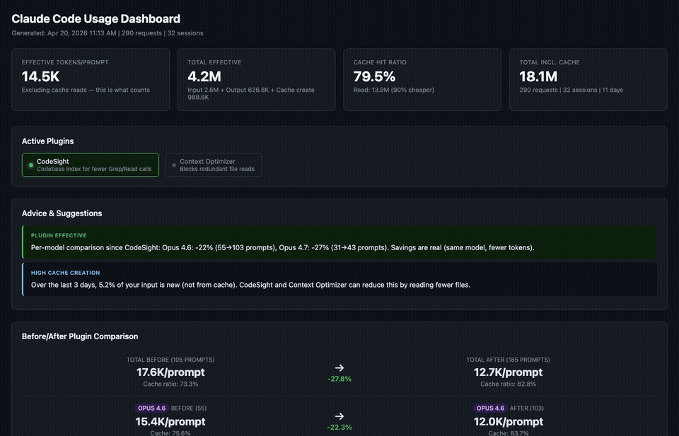

# Claude Code Usage Dashboard

Visual dashboard for tracking Claude Code token usage with per-prompt granularity, plugin effectiveness tracking, and optimization advice.



## Quick start

```bash
npx github:Bramvzw/claude-usage-dashboard
```

Or clone the repo:

```bash
git clone https://github.com/Bramvzw/claude-usage-dashboard.git
cd claude-usage-dashboard
./run-dashboard.sh
```

This parses your `~/.claude/projects/` JSONL files and opens the dashboard in your browser.

## Features

- **Per-prompt token breakdown** — input, output, cache read, cache creation grouped by user prompt
- **Daily usage per model** — stacked charts for Opus, Sonnet, Haiku
- **Before/after plugin comparison** — effective tokens (excluding cache reads) with per-model normalization
- **Median-based charts** — resistant to outliers from expensive prompts
- **Cache hit ratio tracking** — monitor cache efficiency over time
- **Active plugin detection** — CodeSight, Context Optimizer, Skill Manager, MCP servers
- **Automatic advice** — model routing suggestions, expensive prompt detection, cache efficiency tips
- **Filterable prompt table** — filter by model, date range, search term
- **Expensive prompt highlighting** — flagged prompts costing 5x+ the average

## Plugin markers

Track when you install optimization plugins by creating a `markers.json` file:

```bash
cp markers.example.json markers.json
```

```json
[
  { "date": "2025-04-18", "label": "CodeSight" },
  { "date": "2025-04-20", "label": "Context Optimizer" }
]
```

Markers appear as vertical lines on all charts and enable before/after comparisons.

## Requirements

- Node.js 18+
- Claude Code (reads data from `~/.claude/projects/`)

## How it works

1. `parse-usage.mjs` streams all JSONL conversation files from `~/.claude/projects/`
2. Deduplicates API requests by `requestId` and groups them by user prompt via `parentUuid` chain
3. Tracks tokens per model for accurate per-model comparisons
4. Computes daily aggregates, session metrics, and plugin detection
5. Outputs `dashboard-data.js` loaded by the self-contained `dashboard.html`
